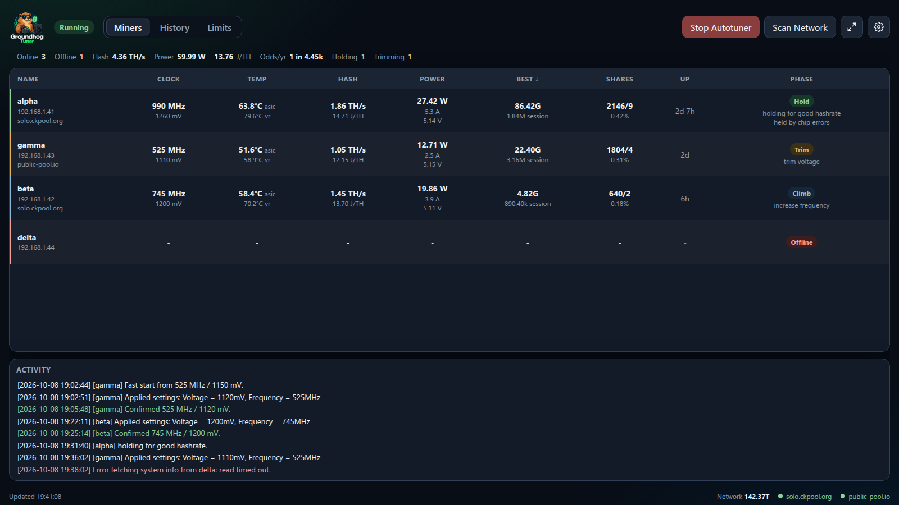
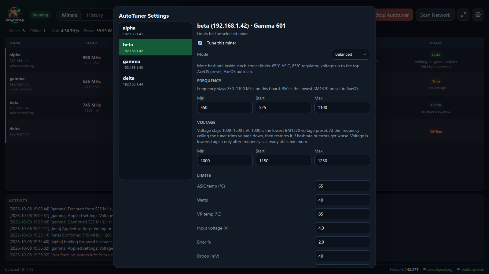

# Groundhog Gamma Tuner

<p align="center">
  
</p>

A personal desktop tuner for one setup: custom-cooled Bitaxe Gamma 601 boards (ASIC BM1370, board version 601) on a Windows ARM tablet. The clocks, voltage, temperatures, and power guard in this repository are highly optimized for that cooling and that power supply. The app checks the live board and saves a miner only when AxeOS reports a BM1370 on board 601. It refuses every other board. It is not a tuner for a stock Gamma, and it is not a multi-model Bitaxe app.

It runs as a local dashboard window, watches the miner's AxeOS API, and adjusts frequency and voltage to hold a higher hash rate without crossing that board's limits. The page is a file inside that window. It is not a site, and it does not listen on the network.

## Credit

This project is a heavily modified fork of [bitaxe-temp-monitor](https://github.com/Hurllz/bitaxe-temp-monitor) by [Hurllz](https://github.com/Hurllz). Copyright in the original work remains with Hurllz. Copyright in these modifications is held by Andrey Rychkov. This copy is published at [Huldoser/groundhog-gamma-tuner](https://github.com/Huldoser/groundhog-gamma-tuner).

The upstream project also includes work by [DeanCollier](https://github.com/DeanCollier), Andrew Kuehne ([andewkuehne](https://github.com/andewkuehne)), [mrv777](https://github.com/mrv777), and GUI work credited to Birdman332. The headless web server, Docker setup, and Linux, macOS, and Raspberry Pi launch paths from that project are not in this fork.

This is an unofficial tool. It is not affiliated with Hurllz or the Bitaxe project.

## What it does

1. Confirms the board is a Gamma 601 and enables overclocking. Nothing learned in an earlier session is saved or carried over: weather, paste, and voltage change too much between runs. A miner that is hashing inside its limits continues from the clocks it is running right now, read live from AxeOS, so restarting the dashboard does not drop it back to stock. A miner that is off, in overheat mode, faulted, or outside its limits starts from its start clocks (525 MHz / 1150 mV unless you change them). **Continue from current clocks** in Global Settings turns this off, and **Reset to Baseline** puts a miner back on stock.
   With **Fast start** on (Global Settings, on by default), it then jumps frequency and voltage toward a point 6°C under the ASIC and regulator caps. It holds each jump about a minute, longer while the chip is still warming, and fits a line through the watts and temperatures it saw to aim the next one. Voltage rises 0.3 mV per MHz on the way up, and 20 mV more when errors go over the budget. A jump with errors even at max voltage is split in half. Any limit crossed on the way sends it back to the last clocks that held. A cool chip reaches its sweet spot in minutes instead of hours, and the fine tuning below takes over from there.
2. Polls AxeOS and waits until the miner reports the new setpoint before the next step.
3. Lowers frequency if ASIC temperature, regulator temperature, power, core current, input voltage, or core-voltage droop crosses the limit.
   Core current is capped at 28 A per miner by default (**Core current (A)** in AutoTuner Settings, never above 29 A). AxeOS sets the Gamma's regulator to shut down with no retry at 30 A. The tuner does not climb or raise voltage into the cap, and the fast start aims 1.5 A under it. At 1.4 V the cap also holds a board to about 44 W at its 5 V plug.
   Temperature caps stay at least 4°C under the AxeOS overheat trip (75°C ASIC, 105°C regulator). Inside that margin the tuner sheds 20 MHz and 10 mV at a time, every 30 seconds, so AxeOS does not cut power and drop the clocks by 100 MHz and 100 mV on its own.
   If AxeOS does trip, the tuner notices the lower clocks, puts them back on the saved minimum once the chip is cool, and climbs again from there. If AxeOS leaves the chip off in overheat mode, the tuner writes the minimum clocks, clears the flag, and restarts the miner once. That happens after a trip from under 1100 mV: AxeOS saves a voltage under 1000 mV, which the regulator refuses.
   A heat retreat also drops one voltage step while errors are at most half the budget, so voltage raised for a higher clock does not keep heating a lower one. At the frequency floor, voltage only drops for heat while errors still fit the budget, and never for errors.
4. Raises voltage only when the ASIC error percentage is above the budget, then raises frequency while errors stay inside that budget.
   A cool chip climbs up to 4 frequency steps (20 MHz) per settle. The jump is sized so that even if power and heat rose in full proportion to frequency, the chip and regulator would still be a tolerance band under their caps and power would stay under its cap. Within two tolerance bands of a cap, or with errors over half the budget, it climbs one step. A jump that loses hashrate steps back without raising voltage. The next climbs up to that clock go one step at a time. Set `"max_climb_steps": 1` in `config.json` to always climb one step.
5. Trims voltage down at the ceiling, then holds. The Phase column shows what is holding it (temperature, chip errors, power, input sag, and so on). The fan stays at full speed for the whole session, so a warmer room is what moves the clocks.
   A hold under a hashrate or silicon wall climbs again once the chip is 3°C cooler than when it hit that wall, or after 6 hours, as long as errors are at most half the budget.
6. Restarts a miner once when its settled errors stay far over the budget (10%, or 5× a larger budget). That is not a silicon wall, and AxeOS can leave the ASIC like that after an overheat recovery. If a soft restart does not clear it, unplug the miner for 30 seconds.



Alpha is holding a high clock, beta is still climbing, gamma is trimming with the regulator in the warning band, and delta is offline.



Each saved miner has its own frequency, voltage, and temperature limits.

## This setup

These Gammas use a custom shell with better cooling than a stock board. Most can hold higher clocks than the usual 700–800 MHz, but each BM1370 is different and the tuner stops that chip on heat or errors. It does not assume every board can hold the frequency cap.

The power supply is oversized for this setup and is not the tuning limit. The 50 W figure is a fault guard. If a barrel jack or board trace ever runs hot, lower that miner's watt cap.

The default caps are 70°C on the chip and 95°C on the regulator, set for repasted miners. 70°C is 1°C under the tuner's trip guard and 5°C under AxeOS's 75°C cutoff. The regulator chip is rated far hotter than 95°C. Miners saved with lower caps are raised to these once, the first time this version loads `config.json`; a cap lowered after that stays where it is. The tuner climbs while both sensors are at or under their caps and steps frequency down once one goes over. After a heat retreat it holds until both are a tolerance band (3°C by default) under their caps, about 67°C and 92°C, then climbs again. A hotter afternoon takes a larger step than a one-degree drift. A cooler night lets a chip that is still under its frequency cap climb again.

AxeOS will still emergency-stop at 75°C on the ASIC or 105°C on the regulator, then restart about 100 MHz and 100 mV lower. These limits stay under that, so the tuner remains the controller. Max core voltage defaults to 1500 mV, the hard cap in `config.py`. The core-current cap (28 A) usually stops a miner well before that.

Frequency can step down to 350 MHz. That is the lowest BM1370 clock in the AxeOS v2.15.1 preset list (the Gamma Duo list; the Gamma list starts at 400). A Min frequency typed under 350 is saved as 350. Core voltage stays at or above 1000 mV, the lowest BM1370 voltage preset. The tuner lowers voltage only after frequency is already at its minimum, so a weak chip is settled with a lower clock, not a lower voltage. A saved miner keeps its Min frequency until that field is changed. Miners already saved at 400 MHz stay there.

Those targets match this cooling and this power supply. Another board, a stock cooler, or a smaller supply needs its own limits.

## History and weather

The **History** tab next to the status pill shows how each miner ran and what the weather outside was at the time. The miners sit in an entrance room with the windows open, so the outdoor temperature drives the air they breathe.

- While the window is open, every miner is saved every 10 minutes in `history.db` next to `config.json`. Each sample has the clock, the 10-minute hashrate less the error share, the temperatures, the power, and the weather outside. A sample counts as settled when its setpoint and the miner's uptime are both at least 10 minutes old. The results use only settled samples.
- The filters pick one miner or the whole fleet, a period (24 hours to everything, or **Since reset**), and a measure: good hashrate, efficiency (J/TH, lower is better), or clock.
- **Over time** has one line per miner, with the outdoor temperature on its own strip under it. **When it runs best** averages each hour of the day against each 3 °C band of outdoor temperature. **Best combinations** ranks outdoor temperature, time of day, and sky by the chosen measure. The tiles show the best result and its conditions, the typical (median) result, and how much each 1 °C warmer outside costs.
- Weather comes from [Open-Meteo](https://open-meteo.com/) every 15 minutes. It is free for personal use and needs no key; the data is under CC BY 4.0. A sample saved while the weather could not be read is filled in later from Open-Meteo's hourly history, up to 92 days back.
- **Settings > Weather Location** sets the place. **Use This Device's Location** asks Windows location services for the tablet's position. That needs Location on under Settings > Privacy & security > Location, with **Let desktop apps access your location** on. The place name then comes from one [Nominatim](https://nominatim.org/) lookup. You can also search for a city, for example `Moose Jaw, Saskatchewan`. With no place saved, the app tries the device once when it starts.

### Fresh start

Double-click a miner (or right-click and choose **Reset to Baseline**) to write the stock 525 MHz / 1150 mV and make those its start clocks. **Settings > Reset All to Baseline** does the same for every miner. Both stop at a confirmation first. A reset is also marked in the history, so **Since reset** shows only what the miner did after it. Every Start Autotuner tunes from the start clocks anyway, so a repaste needs no reset; set the date under **Edit Miner** instead.

A miner shows as offline only after three missed reads in a row (about 15 seconds). One missed read shows "no reply" under its phase and keeps the last values; a reboot or a Wi-Fi blip looks like that. The log says once when a miner stops answering and why (timed out, refused, unreachable), and once when it is back. A core voltage more than the droop limit under its setting is marked in amber after three reads in a row; one read right after a voltage change is the rail catching up.

## Requirements

- Windows on ARM tablet
- Python 3 from [python.org](https://www.python.org/downloads/windows/), using the **Windows installer (64-bit)**. The 64-bit build runs under emulation on this tablet. The ARM64 installer cannot open the window, because pywebview’s .NET helper does not load in that build.
- The packages in `requirements.txt` (`requests` and `pywebview`)
- The Edge WebView2 runtime, which Windows 11 already includes

## Install

Open Command Prompt in this folder. Install the packages with the 64-bit interpreter. `pip` on PATH may still be the ARM64 one. List the interpreters:

```bat
py -0p
```

Use the `python.exe` whose folder is not `Python313-arm64`:

```bat
"%LocalAppData%\Programs\Python\Python313\python.exe" -m pip install -U -r requirements.txt
```

## Run

```bat
python main.py
```

That opens the dashboard in its own window. If the ARM64 build is the `python` on PATH, `main.py` starts the 64-bit interpreter instead. The tablet and the Gamma 601 need to be on the same network. Add the miner by IP, or scan a range. The app saves a miner only after AxeOS reports a BM1370 on board 601.

## Desktop shortcut

Double-click `install-shortcut.bat`.

That creates a desktop shortcut named Groundhog Gamma Tuner. Double-clicking the shortcut runs `run.bat`, which starts the window with no console. The shortcut icon is `assets/app_icon.ico`, made from `assets/app_icon.png`. Settings are saved in `config.json` next to the scripts. If that file is missing, the app creates it. `config.example.json` is the starting template, with an empty miner list.

## Start when you log on

Use Task Scheduler so the window opens after you sign in.

1. Press Win+R, type `taskschd.msc`, and press Enter.
2. Choose **Create Basic Task**. Name it `Groundhog Gamma Tuner`.
3. Trigger: **When I log on**.
4. Action: **Start a program**.
5. Program: the full path to `run.bat`. Example: `C:\Users\YourName\groundhog-gamma-tuner\run.bat`
6. On **Conditions**, clear **Start the task only if the computer is on AC power**.

## Checks

Install the checkers with the same interpreter you use for this repo. They are not part of the window install.

```bat
python -m pip install -r requirements-dev.txt
pre-commit install
```

`pre-commit install` adds a push hook. `git push` then runs the checks and stops if they fail. `git push --no-verify` skips the hook. Run the same checks by hand with:

```bat
pre-commit run --all-files --hook-stage pre-push
```

That runs `ruff check`, `ruff format --check`, and `python -m unittest`. To rewrite formatting and apply Ruff's safe fixes:

```bat
python -m ruff check --fix .
python -m ruff format .
```

## Disclaimer

This program writes frequency, voltage, fan, and overclock settings to a miner. The limits in this repository were chosen for the author's custom-cooled Gamma 601 boards and oversized power supply. They are above stock clocks. They are for that cooling and that power, not for someone else's board.

Overclocking can overheat the ASIC, the regulator, the board, or the barrel jack. That can damage the hardware or start a fire. A stock cooler, a weak supply, a loose jack, or a warm room makes that more likely.

You are responsible for the cooling, power, and limits on your own hardware. Read the settings before you start, and lower them if you are not sure.

The software is provided as is, without warranty. Andrey Rychkov and the other authors are not responsible for damaged hardware, injury, fire, lost mining, or any other loss from using it. The legal warranty disclaimer is in the [MIT License](LICENSE).

## License

MIT. Copyright (c) 2025 Hurllz and Copyright (c) 2026 Andrey Rychkov. See [LICENSE](LICENSE).
